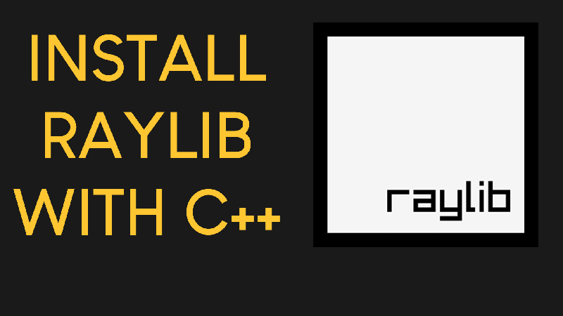

# Raylib C++ Starter Template

Raylib C++ Starter Template for Visual Studio Code on Windows.

Bu "README" dosyası aslında YouTube'da "Programming with Nick" hesabına ait olup değiştirilmiştir.

Bu YouTube kullanıcısının Raylib'in kurulumu konusunda bana büyük katkısı olmuştur. Eğer Raylib'i
bir oyun geliştirme kütüphanesi olarak kullanmak isterseniz size de yardımı olabilir.

# Video Tutorial

  

🎥 <a href="https://www.youtube.com/watch?v=PaAcVk5jUd8">Video Tutorial on YouTube (Yukarıda Belirtilen YouTube Kullancısının Video Tutorial'ı) </a>

 
 

| 📺 <a href="https://www.youtube.com/channel/UC3ivOTE5EgpmF2DHLBmWIWg">My YouTube Channel  (Yukarıda Belirtilen YouTube Kullancısının Kanalı) </a>
| 🌠<a href="https://www.programmingwithnick.com">My Website (Kullanıcının Web Sitesi) </a> |  

